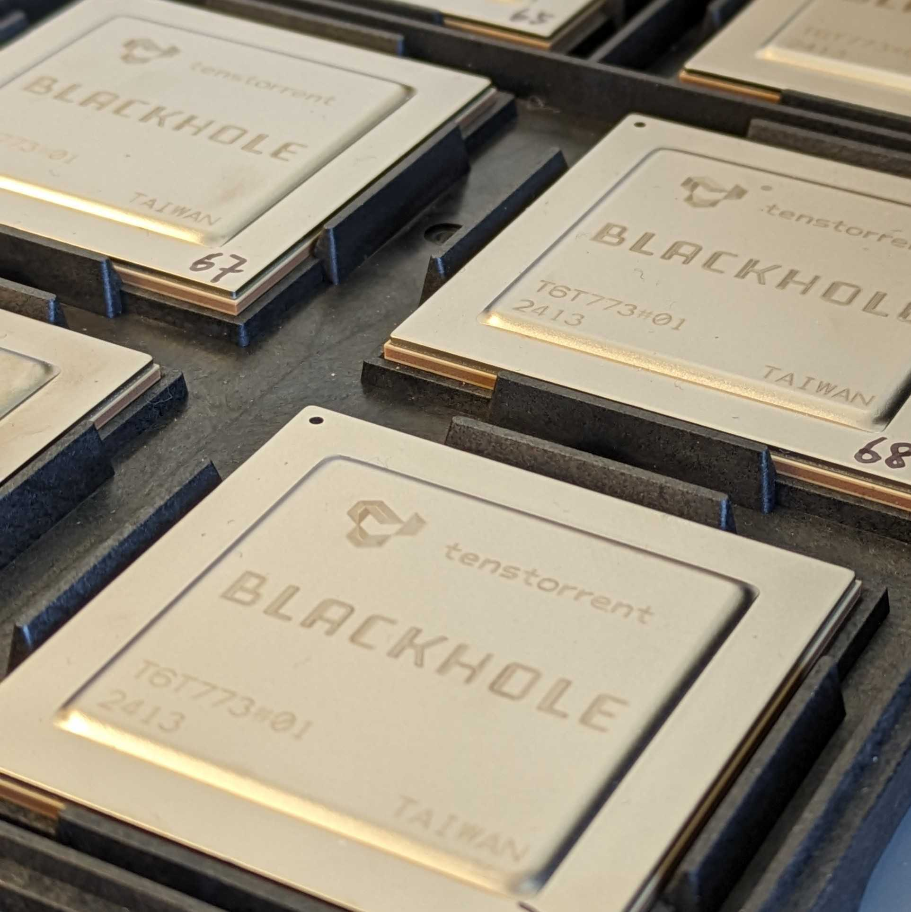

.. _bh_arc:

Blackhole ARC Board
###################

The Blackhole ARC "board" is a conceptual board that we use for BlackHole firmware running on
the internal ARC core of the Blackhole SoC, which is responsible for chip-management.

Overview
********

The Blackhole SoC is Tenstorrent's third-generation AI accelerator SoC, packing up to

* 140 Tensix |Trade| cores
* 8 GDDR6 channels for 3.5 Tb/s of throughput
* 32 GB of on-board GDDR6 memory
* 6 Ethernet ports at 400 Gb/s
* 16 PCIe 5.0 lanes for 500 Gb/s of throughput

See the `Blackhole Product Page`_ for additional details and specifications.

   Tenstorrent Blackhole SoC

Hardware
********

The ARC chip management cores run at 800 MHz and are responsible for managing connectivity, power,
and other chip-level functionality.

Supported Features
==================

The Blackhole ARC cores have access to the following features:

.. Add devices as drivers are enabled.

+-----------+------------+------------------+
| Interface | Controller | Driver/Component |
+===========+============+==================+
| GPIO      | on-chip    | gpio             |
+-----------+------------+------------------+
| PINMUX    | on-chip    | pinmux           |
+-----------+------------+------------------+
| UART      | on-chip    | serial           |
+-----------+------------+------------------+
| I2C       | on-chip    | i2c              |
+-----------+------------+------------------+
| SPI       | on-chip    | spi              |
+-----------+------------+------------------+

Other hardware features have not been enabled yet for this board.

Connections and IOs
===================

All I/O signals are accessible from the BoosterPack connectors. Pin function
aligns with the SensorTag standard.

.. Add pinctrl entries as they are enabled.

+--------+-----------+---------------------+
| Pin    | Function  | Usage               |
+========+===========+=====================+
| GPIO48 | UART TX   | UART                |
+--------+-----------+---------------------+
| GPIO49 | UART RX   | UART                |
+-------+-----------+---------------------+

Prerequisites:
==============

#. Install Segger J-Link software

   Download and install the latest J-Link software from
   :ref:`here <https://www.segger.com/downloads/jlink/>`_.

#. Install OpenOCD

.. tabs::

   .. group-tab:: Ubuntu

      OpenOCD should be installed along with the `Zephyr SDK <toolchain_zephyr_sdk>`.

   .. group-tab:: macOS

      OpenOCD should be installed via `Homebrew <https://brew.sh/>`_.

         .. code-block:: bash

            brew install openocd

   .. group-tab:: Windows

      ¯\_(ツ)_/¯

#. Install a terminal emulator (e.g. minicom, putty, etc.) for console I/O

.. tabs::

   .. group-tab:: Ubuntu

         .. code-block:: bash

            sudo apt install -y minicom

   .. group-tab:: macOS

         .. code-block:: bash

            brew install minicom

   .. group-tab:: Windows

      ¯\_(ツ)_/¯

Programming and Debugging
*************************

The Blackhole ARC cores require both a system JTAG connection as well as an ARC JTAG connection.
The system JTAG connection is used for programming SPI flash from the PCIe host, while the ARC
JTAG is used to to control and inspect the ARC cluster. A USB serial adapter is used for direct
UART I/O, the Zephyr console, and the Zephyr shell.

.. FIXME: add either a diagram or photo of the debug setup

Open a terminal emulator to connect to the Blackhole ARC UART. The device node will vary depending
on the host OS and serial adapter.

.. code-block:: bash

   $ minicom -w -b 115200 -D /dev/tty.usbmodem1234

Building
========

Production firmware can be built using the standard Zephyr build system. For other apps, tests,
and samples, simply point the build system to the desired app directory.

.. zephyr-app-commands::
   :zephyr-app: ../modules/bh-cmfw/app/
   :host-os: unix
   :board: bh_arc
   :goals: build
   :compact:

Flashing
========

Use ``boot.py`` to flash firmware to the target (note: this requires cloning the syseng repo)

.. code-block:: bash

    # only required once
    pushd syseng/src/t6ifc/t6py
    ./bin/venv-create ../../../../.venv
    popd

.. code-block:: bash

    # required each time a new terminal is opened
    pushd syseng/src/t6ifc/t6py
    . bin/venv-activate.sh ../../../../.venv
    popd

.. code-block:: bash

    # each time the firmware needs to be flashed
    cp $ZEPHYR_BASE/build/zephyr/zephyr.bin ./syseng/src/t6ifc/t6py/packages/tenstorrent/data/blackhole/fw/cmfw.bin
    ./syseng/src/t6ifc/t6py/packages/tenstorrent/scripts/boot.py

If successful, the output of ``boot.py`` should look like the following:

.. code-block:: console

    Pin 8 -> 0
    Pin 8 -> 1
    JLink open
    Running mini bootcode
    Mini bootcode done
    Running CMFW
    CMFW done
    JLink close

Debugging
=========

Production firmware can debugged in the usual way. For debugging other apps, repease the build,
flash, and debug steps for the desired app.

.. zephyr-app-commands::
   :zephyr-app: ../modules/bh-cmfw/app/
   :board: bh_arc
   :maybe-skip-config:
   :goals: debug

`Additional arguments <https://yyz-gitlab.local.tenstorrent.com/syseng-platform/bh-cmfw/-/blob/main/doc/faq.md>`_
may be required when there are more than 1 JTAG adapters connected to the host. For example,

.. code-block:: bash

   west <flash|debug|debugserver> --cmd-pre-init 'adapter usb location 1-4'

References
**********

.. _Blackhole Product Page:
   https://tenstorrent.com/hardware/blackhole
